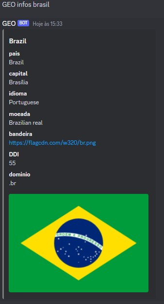

# GEO-BOT-Discord
## Descrição
Um bot simples que retorna informações de países como capitais, bandeiras, moedas, idiomas, etc

## Funcionamento
Ele faz requisições para um API Rest chamado [REST Countries](https://restcountries.com/).

## Comandos

